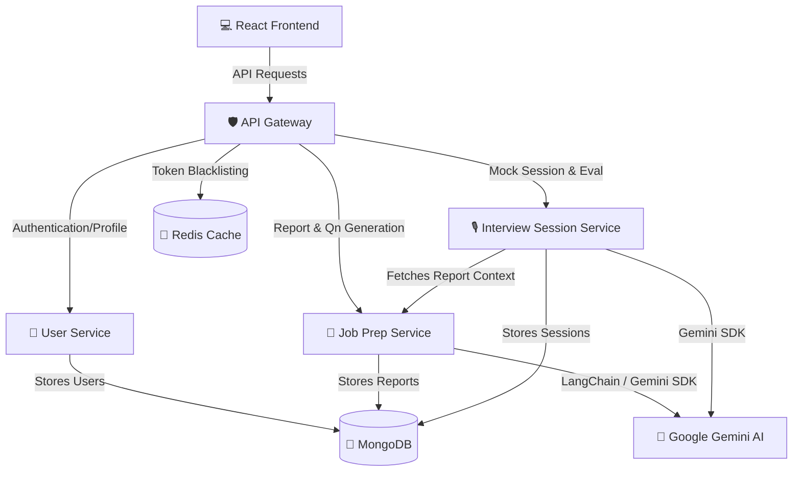

# 🤖 PrepBot (Job Prep Application)

A state-of-the-art, AI-powered mock interview and job preparation platform. PrepBot analyzes resumes and job descriptions using Google Gemini AI, generates tailored interview questions, conducts interactive interview sessions, and provides deep analytical performance feedback to candidates.

---

## 🏗️ Project Architecture

PrepBot is built using a modern **Microservices Architecture**. It decouples authentication, profile management, AI analysis, and session state to ensure scalability, fault isolation, and independent service deployability.



### Microservices Directory
1. **[React Frontend](file:///d:/Documents/Project/Job%20Prep%20-%20Application/frontend)**: A sleek, responsive dashboard built with React, TypeScript, and TailwindCSS.
2. **[API Gateway](file:///d:/Documents/Project/Job%20Prep%20-%20Application/backend/api-gateway)**: Built with Express, http-proxy-middleware, and Redis. It acts as the single entry point, handles CORS, aggregates routes, and verifies/blacklists JWT auth tokens.
3. **[User Service](file:///d:/Documents/Project/Job%20Prep%20-%20Application/backend/user-service)**: Manages database connections for user accounts, passwords (hashed via `bcryptjs`), and generates JWT tokens.
4. **[Job Prep Service](file:///d:/Documents/Project/Job%20Prep%20-%20Application/backend/jobPrep-service)**: Parses resumes (PDF format), digests target job descriptions, and utilizes Gemini API (via LangChain / `@google/genai`) to generate personalized candidate reports and target questions.
5. **[Interview Session Service](file:///d:/Documents/Project/Job%20Prep%20-%20Application/backend/interview-session-service)**: Runs mock interviews, handles real-time response evaluations, calculates scores, and delivers final interview feedback via AI comparison models.

---

## ⚡ Tech Stack

### Frontend
- **Framework**: React 18 with Vite (Fast Refresh & HMR)
- **Language**: TypeScript
- **Styling**: TailwindCSS & PostCSS
- **Routing**: React Router DOM (v6)
- **Icons**: Lucide React
- **API Client**: Axios

### Backend Services
- **Runtime**: Node.js & TypeScript
- **Framework**: Express (v5)
- **AI Integrations**: `@google/genai` (Google Gemini AI), LangChain, Zod schema validation
- **Parsing**: `pdf-parse` for parsing PDF resumes
- **Databases & Cache**: 
  - **MongoDB** (Object data modeling via Mongoose)
  - **Redis** (Used for auth token blacklisting/caching at the Gateway level)
- **Containerization**: Docker & Docker Compose

---

## 🛠️ Getting Started

### Prerequisites
- Node.js 18+ & npm
- Docker Desktop (recommended for running services & databases locally)
- A **Google Gemini API Key** (Get one from [Google AI Studio](https://aistudio.google.com/))

---

### Configuration (Environment Variables)

Before booting the applications, configure the environment files.

1. **Backend**:
   Copy `backend/.env.example` to `backend/.env` and update the placeholders:
   ```env
   # Ports
   PORT_API_GATEWAY=3000
   PORT_USER=8080
   PORT_JOB=8081
   PORT_SESSION=8082

   # Authentication
   JWT_SECRET=your_jwt_secret_here

   # MongoDB URIs
   MONGO_URI_USER=mongodb://mongo:27017/users
   MONGO_URI_JOB_PREP=mongodb://mongo:27017/jobprep
   MONGO_URI_SESSION=mongodb://mongo:27017/session

   # Redis
   REDIS_URL=redis://redis:6379

   # Gemini API Keys
   GEMINI_API_KEY_JOB_PREP=your_gemini_api_key_here
   GEMINI_API_KEY_SESSION=your_gemini_api_key_here

   # Internal Service URLs (Docker Hostnames)
   JOBPREP_SERVICE_URL=http://jobprep-service:8081
   USER_SERVICE=http://user-service:8080
   JOBPREP_SERVICE=http://jobprep-service:8081
   SESSION_SERVICE=http://interview-session-service:8082
   ```

2. **Frontend**:
   Create a `frontend/.env` file:
   ```env
   VITE_API_GATEWAY_URL=http://localhost:3000
   ```

---

### Run via Docker Compose (Recommended)

To spin up MongoDB, Redis, and all backend services concurrently in containers, navigate to the `backend` directory and run:

```bash
cd backend
docker-compose up --build
```

This starts:
* **MongoDB** at `localhost:27017`
* **Redis** at `localhost:6379`
* **API Gateway** at `localhost:3000`
* **User Service** at `localhost:8080`
* **Job Prep Service** at `localhost:8081`
* **Interview Session Service** at `localhost:8082`

---

### Running Locally for Development

If you prefer to run services manually on your local host (e.g., to debug step-by-step), you must have local MongoDB and Redis servers running.

#### 1. Start Database & Cache
Ensure Mongo is running at `localhost:27017` and Redis at `localhost:6379` (or update `.env` connection URIs to point to your local servers, e.g. replacing `mongo` and `redis` hosts with `localhost`).

#### 2. Start Backend Services
For each directory in `backend/api-gateway`, `backend/user-service`, `backend/jobPrep-service`, and `backend/interview-session-service`:
```bash
# In each folder:
npm install
npm run dev
```

#### 3. Start Frontend
In a separate terminal, navigate to `frontend`:
```bash
cd frontend
npm install
npm run dev
```
The application will be accessible at [http://localhost:5173](http://localhost:5173) (or the port indicated in the console).

---

## 🔌 API Gateway Routing Map

All requests from the frontend should be directed through the **API Gateway** (`http://localhost:3000`).

| Source Path | Gateway Route | Target Service | Authentication Required | Description |
| :--- | :--- | :--- | :---: | :--- |
| `/api/v1/auth/register` | Forwarded | User Service | ❌ | Registers a new user |
| `/api/v1/auth/login` | Forwarded | User Service | ❌ | Authenticates user & returns JWT |
| `/api/v1/auth/logout` | Intercepted | API Gateway (Redis) |  | Blacklists the JWT token |
| `/api/v1/auth/getMe` | Forwarded | User Service |  | Fetches the current authenticated user |
| `/api/v1/jobprep/` | Forwarded | Job Prep Service |  | Generates a report & questions from resume + JD |
| `/api/v1/jobprep/reports` | Forwarded | Job Prep Service |  | Lists all generated reports |
| `/api/v1/jobprep/reports/:id` | Forwarded | Job Prep Service |  | Retrieves details of a specific report |
| `/api/v1/session/start` | Forwarded | Interview Session Service |  | Initiates a new mock interview session |
| `/api/v1/session/answer` | Forwarded | Interview Session Service |  | Submits a candidate response for real-time scoring |
| `/api/v1/session/report/:id` | Forwarded | Interview Session Service |  | Fetches session data linked to a specific report |
| `/api/v1/session/:id/results` | Forwarded | Interview Session Service |  | Generates final analytics & AI feedback for a session |

---

## 🎨 Application Walkthrough

### 1. Register & Login
Users sign up with credentials. The backend signs a JWT token returned to the frontend, authorizing subsequent requests via the API Gateway.

### 2. Job Report Generation
Candidates upload their Resume in PDF format and paste the target Job Description (JD). The **Job Prep Service** extracts text, invokes the **Google Gemini model** to compare skills, lists strengths/gaps, and customizes a set of technical and behavior-based interview questions.

### 3. Interactive Mock Interview
Once the report is generated, candidates can initiate a session. The **Interview Session Service** guides the user through the questions sequentially. The user provides answers which are analyzed in real time.

### 4. Detailed Evaluation & Feedback
Upon completion, the system aggregates the results, yielding a total score, listing breakdown ratings for communication, correctness, and speed, and presenting a personalized study plan to target weaknesses.
